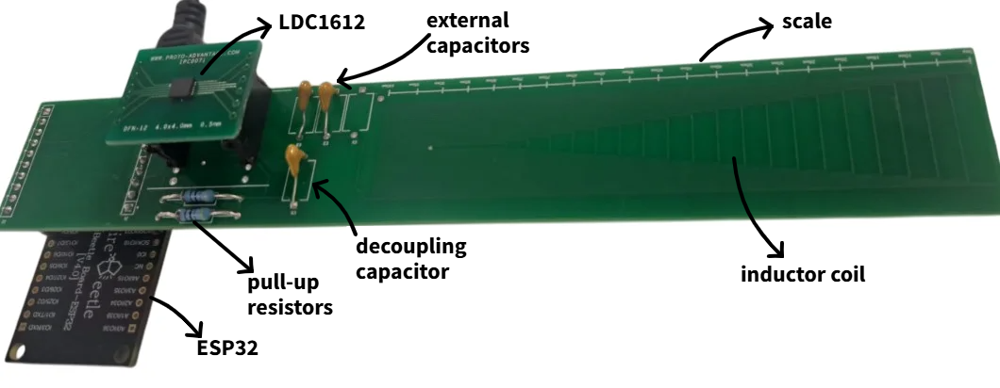

# 📡Inductive Displacement Sensor — Quick Start Guide
Developed as part of the Inductive Displacement Sensor coursework project in the Sensors Year 4 Module in Electrical & Electronic Engineering.

This repository contains the **embedded firmware** and **PC-based user interface** developed for an inductive displacement sensor using a stretched-spiral PCB coil, LDC1612 inductance-to-digital converter, and an ESP32 microcontroller. 

  

The system measures resonance frequency changes due to target displacement and converts them into a calibrated position output, which is visualised in real-time using a **Streamlit dashboard** through a Python backend 

## Key Specifications
- **Sensing principle:** Inductive displacement sensing using a PCB trace coil forming an LC resonant tank  
- **Readout method:** Resonance frequency measurement via inductance-to-digital conversion  

| Parameter | Value |
|---------|-------|
| Operating frequency | 4.68 MHz (4.39–4.60 MHz tuning range) |
| Sensor type | Unshielded PCB-integrated stretched-spiral coil |
| Operating principle | Eddy-current inductive shift |
| Measurement range | 0–100 mm |
| Usable linear range | 10–75 mm |
| Coil inductance | 13.642 µH |
| Tank (external) capacitance | 76 pF |
| Sensitivity (linear range) | 2.956 kHz/mm |
| Linearity error (linear range) | 4.197 % FS |
| Resolution | 5 mm |
| Limit of detection | 0.02404 mm |
| Sampling rate | 2 Hz |
| Supply voltage | 3.3 V |
| Power consumption | 2.376 mW |
| Quality factor | 31.53 dB |
| Mean absolute error | 0.551 mm |
| R² fit | 0.998700 |
| Accuracy | ±2.70 % |
| PCB Dimensions | 180 × 30 mm |
| Target material | Aluminium, Copper |
| Interface | I²C (sensor front-end), USB/Serial to host PC |

Full theoretical background, hardware design, calibration procedure, and detailed performance analysis are provided in the project report.

## Embedded Firmware (PlatformIO)

The embedded code is developed using **PlatformIO in VS Code**. This repository is structured to be opened **directly as a PlatformIO project**. 

Calibration is performed experimentally and embedded in the firmware logic.

## User Interface 

The instructions for starting the UI are in the "Starting UI - Inductive Displacement Sensor" file.

- Reads frequency or position data from the serial port
- Displays displacement after calibration
- Intended for demonstration, testing, and validation of the sensor

## Notes
- Ensure **PlatformIO** is installed in  **VS Code**. 
- Connect the microcontroller to the host PC via USB/serial.
- Select the correct serial port connected to the microcontroller.

